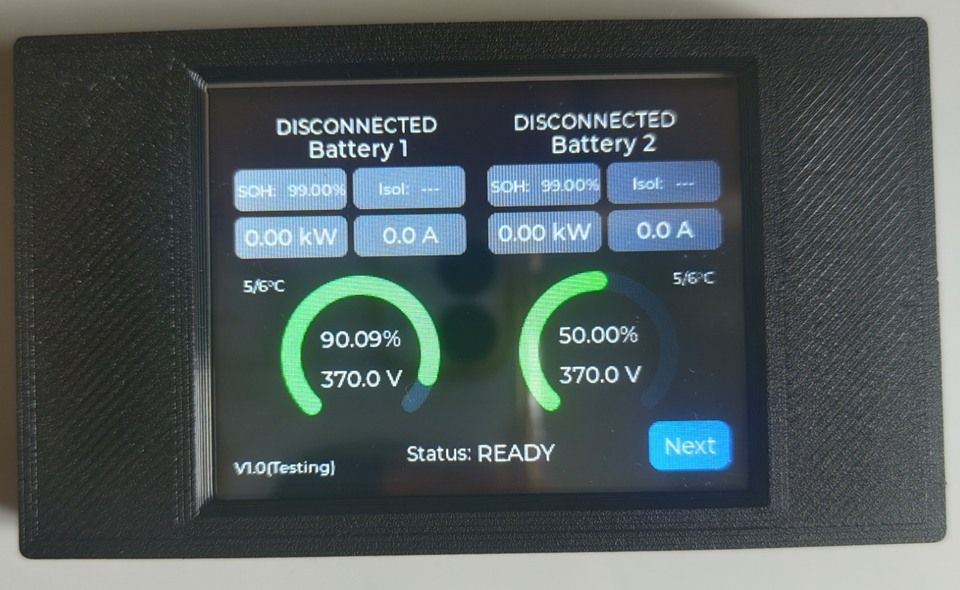
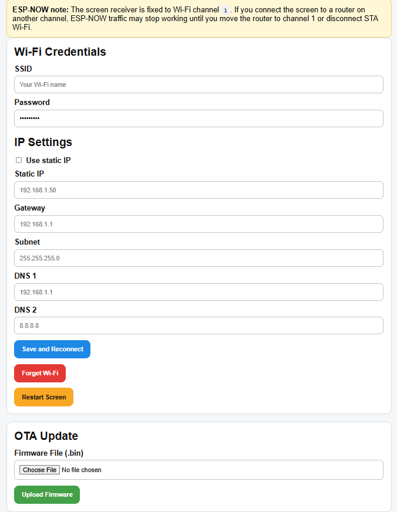
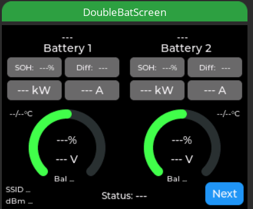
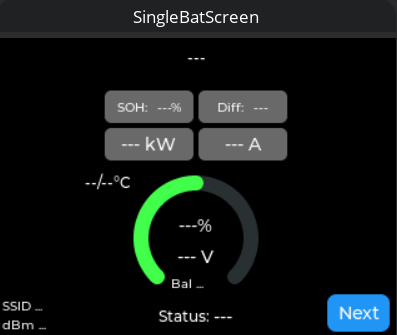
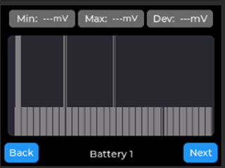
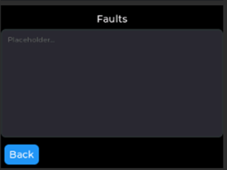

# CYD Battery Emulator Display

> **Testing note:** This project has only been tested with an ECMP battery. It may not work correctly with other battery integrations. If you encounter a problem, please report it and I will work on a fix.

This project turns a 2.8-inch Cheap Yellow Display (CYD), such as the
`ESP32-2432S028R`, into a separate touchscreen display for
[Battery-Emulator](https://github.com/dalathegreat/Battery-Emulator).

The display receives live battery data wirelessly using the current ESP-NOW
protocol v2. It supports both single-battery and dual-battery configurations.
Triple-battery support is not available yet, but I can add it if there is demand.

ESP-NOW v2 frames use the `BE` version-2 header and forward-compatible TLV
records. Cell voltages are received in full-resolution millivolts, including
multi-frame cell-voltage data.

Where to buy: [ESP32-2432S028R on AliExpress](https://www.aliexpress.com/item/1005007286667162.html)

## What it does

The display can:

- show live battery data
- automatically switch between one-battery and two-battery layouts
- show cell voltages, temperatures, and faults
- show cell-voltage difference for each battery
- show battery, contactor, balancing, and inverter status
- connect to Wi-Fi
- install firmware updates through the OTA web page

You can power the screen either from `USB` or from `5V`.

## Current limitations

- Single-battery and dual-battery configurations are supported. Triple-battery
  support can be added in the future if there is demand.

## Important

ESP-NOW must be enabled in the Battery Emulator settings:

- `ESP-NOW`

If ESP-NOW is not enabled, the CYD display will not receive battery data.

## Web installer

For a first-time installation, connect the CYD to a computer with a USB data
cable and open the [CYD web installer](https://paultu3.github.io/CYD-Battery-Emulator/)
in Google Chrome or Microsoft Edge. Select the CYD serial port and choose
**Erase device** when prompted.

The installer always builds and publishes the latest firmware from the `main`
branch. Existing installations can still be updated from the CYD OTA web page.

## Updating (OTA)

After the first USB install, you do not need the web installer again.
Download `CYD-OTA-firmware.bin` from the latest
[release](https://github.com/pauLTU3/CYD-Battery-Emulator/releases/latest)
and upload it on the CYD OTA web page.

## Web page

The screen creates its own Wi-Fi access point so it can always be configured.

Default AP name:

- `BatteryEmulator-CYD`

Default AP web address:

- `192.168.4.1`

From the web page you can:

- enter Wi-Fi name and password
- set static IP if needed
- forget saved Wi-Fi
- restart the screen
- upload firmware with OTA

Web page:

## UI

Current SquareLine Studio layouts:

| Dual battery | Single battery |
| --- | --- |
|  |  |
| Cell voltages | Faults |
|  |  |

## Editing UI

The complete editable SquareLine Studio project is included in this repository.
Open [`CYD.spj`](./CYD.spj) in SquareLine Studio to change the screens, labels,
colors, or layout. The project was last saved with SquareLine Studio `1.6.1`.

Export generated UI files to `src/ui/`. Keep the existing object names unless
you also update their references in the firmware source code.

See [SquareLine UI editing instructions](./docs/SQUARELINE.md) for the project
file list, export steps, and contribution notes.

The `SquareLine_CYD/` directory contains the optional Windows LVGL simulator;
it is not the main editable SquareLine project.
